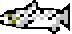

# CRiSP Harvest v3.0.6
*The Columbia River Salmon Passage Harvest Model*

This repository is a mirror of the source code of CRiSP Harvest, a program developed by the Columbia Basin Research of the University of Washington's School of Aquatic & Fishery Sciences.

### Licensing
The contents of this repo were kindly provided to SIBR by the system administrator of CBR.
SIBR makes no claims to the copyright of the project, which most likely lies with the University of Washington.
